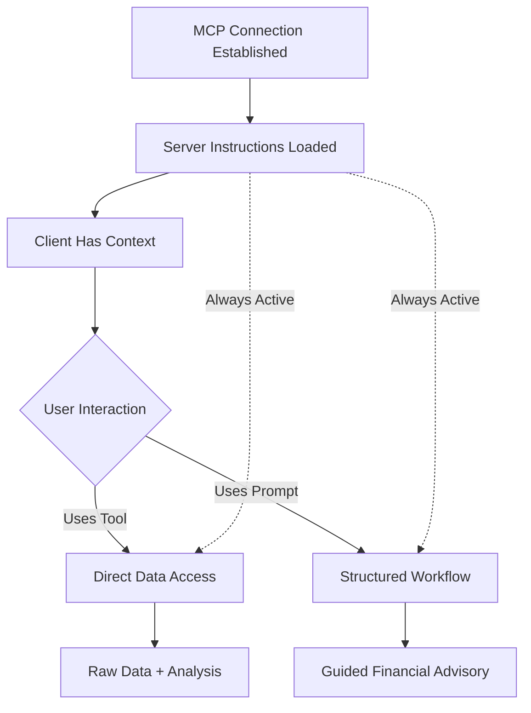

# MCP Architecture: Instructions vs Prompts

## Overview

The Israeli Bank Assistant MCP server uses both **server instructions** and **prompts** to provide a comprehensive financial advisory experience. Understanding the distinction between these two features is crucial for proper implementation.

## Server Instructions

Server instructions are defined at the server initialization level and provide **general guidance** about how to use the server.

### What They Are

- A single, server-wide instruction set
- Automatically sent to the client when the MCP connection is established
- Provides context about the server's capabilities and best practices
- Always active during the entire session

### Example Implementation

```typescript
new Server({
  name: "israeli-bank-assistant",
  version: "2.0.0",
  instructions: `You are connected to the Israeli Bank Assistant MCP server...`,
});
```

### Our Server Instructions Cover:

1. **Server Purpose**: Real-time access to Israeli bank data
2. **Available Features**: Tools and prompts
3. **Usage Guidelines**: How to check data freshness, privacy notes
4. **Role Definition**: Act as a sophisticated financial advisor
5. **Best Practices**: Comprehensive analysis, actionable insights

## Prompts

Prompts are **user-triggered templates** for specific financial advisory workflows.

### What They Are

- Pre-defined interaction templates
- User-controlled (typically via slash commands)
- Task-specific and focused
- Can accept arguments for customization

### Example Prompts

- `/financial_review` - Monthly financial analysis
- `/budget_planning` - Create personalized budgets
- `/fraud_detection` - Scan for suspicious activity
- `/tax_preparation` - Organize data for taxes

## How They Work Together



### Interaction Flow

1. **Connection**: When Claude connects to the MCP server

   - Server instructions are automatically loaded
   - Claude understands the server's purpose and capabilities

2. **General Questions**: User asks about finances

   - Server instructions guide Claude's approach
   - Claude uses tools to fetch data
   - Provides analysis based on instructions

3. **Specific Workflows**: User triggers a prompt
   - Prompt template structures the interaction
   - Multiple tools are called in sequence
   - Comprehensive analysis following the template

## Best Practices

### For Server Instructions

- Keep them concise but comprehensive
- Focus on overall server behavior
- Include privacy and security guidelines
- Define the assistant's role and approach
- Explain available capabilities

### For Prompts

- Create focused, task-specific templates
- Allow customization through arguments
- Structure complex workflows
- Ensure comprehensive coverage of the task
- Include clear output expectations

## Example Scenario

**User**: "How are my finances?"

**With Instructions Only**:

- Claude uses general guidance from server instructions
- Calls various tools to gather data
- Provides analysis based on general best practices

**With Instructions + Prompts**:

- User can trigger `/financial_review` for structured analysis
- Prompt ensures all important aspects are covered
- Consistent, comprehensive output every time

## Implementation Guidelines

1. **Server Instructions** should:

   - Be defined once at server initialization
   - Provide overarching guidance
   - Not be too prescriptive about specific interactions

2. **Prompts** should:
   - Handle specific use cases
   - Be discoverable by users
   - Provide value beyond simple tool calls
   - Structure complex multi-step analyses

## Why Both?

- **Instructions**: Ensure Claude always has context about the server
- **Prompts**: Provide structured workflows for common tasks
- **Together**: Create a professional, consistent financial advisory experience

## Future Considerations

As the MCP protocol evolves, the relationship between instructions and prompts may change. Current best practice is to:

1. Use instructions for server-wide behavior
2. Use prompts for user-initiated workflows
3. Keep them complementary, not redundant
4. Focus on user value in both cases
